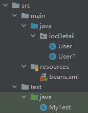

## 4.1-spring创建对象的方法

1. 使用无参构造创建对象，默认

   ```xml
   <bean id="hello" class="di.Hello">
       ...
   </bean>
   ```

2. 使用有参构造创建对象

   1. 通过下标

      ```xml
      <bean id="user" class="iocDetail.User">
          <!--第一种有参构造创建对象，通过下标-->
          <constructor-arg index="0" value="通过下标"></constructor-arg>
      </bean>
      ```

   2. 通过属性类型

      ```xml
      <bean id="user" class="iocDetail.User">
          <!--第二种有参构造创建对象，通过属性类型-->
          <!--有多个同类型的属性，就要根据顺序依次进行赋值-->
          <constructor-arg type="java.lang.String" value="通过属性类型"></constructor-arg>
      </bean>
      ```

   3. 通过属性名称

      ```xml
      <bean id="user" class="iocDetail.User">
          <!--第一种有参构造创建对象，通过参数名称-->
          <constructor-arg name="name" value="通过名称"></constructor-arg>
      </bean>
      ```

## 4.2-spring创建对象的特点

### 4.2.1-在配置文件加载的时候，容器中管理的对象就已经初始化了。

文件结构



1. User

   ```java
   package iocDetail;
   
   public class User {
       private String name;
       
       public User(String name) {
           this.name = name;
       }
   
       public String getName() {
           return name;
       }
   
       public void setName(String name) {
           this.name = name;
       }
   
       public void show() {
           System.out.println("name:" + name);
       }
   
   }
   ```

2. UserT

   ```java
   package iocDetail;
   
   public class UserT {
       private String name;
       
       public UserT() {
           System.out.println("UserT被创建");
       }
   
       public String getName() {
           return name;
       }
   
       public void setName(String name) {
           this.name = name;
       }
   
       public void show() {
           System.out.println("name:" + name);
       }
   
   }
   
   ```

3. beans

   ```xml
   <bean id="user" class="iocDetail.User">
       <!--第一种有参构造创建对象，通过参数名称-->
       <constructor-arg name="name" value="通过名称"></constructor-arg>
   </bean>
   
   <bean id="userT" class="iocDetail.UserT">
   </bean>
   ```

4. MyTest

   ```java
   import iocDetail.User;
   import org.springframework.context.ApplicationContext;
   import org.springframework.context.support.ClassPathXmlApplicationContext;
   
   public class MyTest {
       public static void main(String[] args) {
           // new User();
           ApplicationContext context = new ClassPathXmlApplicationContext("beans.xml");
           User user = (User) context.getBean("user");
           user.show();
       }
   }
   ```

5. 输出：

   ```cmd
   UserT被创建
   name:通过名称
   ```

在beans.xml中，有`user`和`userT`，在MyTest中，仅用到了user，并没有用到userT，而输出时，有运行UserT的无参构造函数，表明`userT`已经创建了。

### 4.2.2-多次引用同一个bean，引用的其实是同一个实例

将`MyTest`代码更改如下

```java
import iocDetail.User;
import org.springframework.context.ApplicationContext;
import org.springframework.context.support.ClassPathXmlApplicationContext;

public class MyTest {
    public static void main(String[] args) {
        // new User();
        ApplicationContext context = new ClassPathXmlApplicationContext("beans.xml");
        User user1 = (User) context.getBean("user");
        User user2 = (User) context.getBean("user");
        System.out.println(user1 == user2);
    }
}
```

输出：

```cmd
UserT被创建
true
```

`user1`和`user2`都引用`user`这个bean，由输出的`true`可得，但这两个其实是同一个实例。