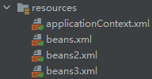

## 5.1-alias 别名

### 5.1.1-文件代码

1. bean

   ```xml
   <bean id="user" class="iocDetail.User">
       <constructor-arg name="name" value="通过名称"></constructor-arg>
   </bean>
   <alias name="user" alias="user_alias"></alias>
   ```

2. MyTest

   ```java
   import iocDetail.User;
   import org.springframework.context.ApplicationContext;
   import org.springframework.context.support.ClassPathXmlApplicationContext;
   
   public class MyTest {
       public static void main(String[] args) {
           // new User();
           ApplicationContext context = new ClassPathXmlApplicationContext("beans.xml");
           User user1 = (User) context.getBean("user");
           User user2 = (User) context.getBean("user_alias");
           System.out.println(user1 == user2);
       }
   }
   ```

### 5.1.2-输出结果

```cmd
true
```

### 5.1.3-分析

`user1`是取出`bean.xml`中名称为`user`的实例

`user2`是取出`bean.xml`中名称为`user_alias`的实例

由结果可知，这两个实例是同一个。

## 5.2-Bean的配置

1. id

   bean的名称，唯一标识符

2. class

   bean对象所对应的全限定名（包名+类名）

3. name

   该bean的别名，并且可以同时取多个别名

   ```xml
   <bean id="user" class="iocDetail.User" name="user2,user3 user4;user5">
       <constructor-arg name="name" value="通过名称"></constructor-arg>
   </bean>
   ```

## 5.3-import

一般用于团队开发使用，可以将多个配置文件，导入合并为一个



在`applicationContext.xml`中输入

```xml
<import resource="beans.xml"></import>
<import resource="beans2.xml"></import>
<import resource="beans3.xml"></import>
```

将各个配置文件导入进来，在`applicationContext.xml`中可以使用每个配置文件中的配置

如果配置重复冲突，会自动选择其中一个，避免冲突