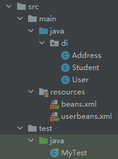

## 准备工作

### 文件结构



### 文件代码

1. Address.java

   复杂类型

   ```java
   package di;
   
   public class Address {
       private String address;
   
       //生成 get() && set()
       
       //生成 toString()
   }
   ```

2. Student.java

   真实测试对象

   ```java
   package di;
   
   import java.util.*;
   
   public class Student {
       private String name;
       private Address address;
       private String[] book;
       private List<String> hobbys;
       private Map<String,String> card;
       private Set<String> game;
       private String wife;
       private Properties info;
   
       //生成 get() && set()
       
       //生成 toString()
       //其中涉及到Address的部分(那一行)需更改为：", address=" + address.getAddress() +
   }
   ```

3. User.java

   包含构造函数

   ```java
   package di;
   
   public class User {
       private String name;
       private int age;
   
       public User(String name, int age) {
           this.name = name;
           this.age = age;
       }
   
       //生成get() & set()
       
       //生成toString()
   }
   ```

4. beans.xml

   ```xml
   <bean id="student" class="di.Student"></bean>
   ```

5. MyTest.java

   ```java
   import di.Student;
   import org.springframework.context.ApplicationContext;
   import org.springframework.context.support.ClassPathXmlApplicationContext;
   
   public class MyTest {
       public static void main(String[] args) {
           ApplicationContext context = new ClassPathXmlApplicationContext("beans.xml");
           Student student = (Student) context.getBean("student");
           System.out.println(student.toString());
       }
   }
   ```

## 6.1-构造器注入

前提：被实现的类具有含参构造函数

注入方式可参考 [4-IoC创建对象的方式与特点.md](4-IoC创建对象的方式与特点.md) —— 4.1

### 6.1.1-代码实现

`userbeans.xml`实现`user类`

```xml
<bean id="user" class="di.User">
    <constructor-arg name="name" value="姓名"></constructor-arg>
    <constructor-arg name="age" value="12"></constructor-arg>
</bean>
```

## 6.2-Set方式注入

依赖注入本质是Set注入

依赖：指Bean对象的创建依赖于容器。Bean对象的依赖资源

注入：指Bean对象中的所有属性，由容器来配置和装配

### 6.2.1-各种方法

1. value
2. ref
3. array
4. list
5. map
6. set
7. null
8. properties

### 6.2.2-实现代码

```xml
<bean id="address" class="di.Address">
    <property name="address" value="地址"></property>
</bean>

<bean id="student" class="di.Student">
    <!--第一种，普通值注入，value-->
    <property name="name" value="姓名"></property>
    <!--或-->
    <!--<property name="name">-->
    <!--    <value>姓名</value>-->
    <!--</property>-->

    <!--第二种，Bean注入，ref-->
    <property name="address" ref="address"></property>
    <!--或-->
    <!--<property name="address">-->
    <!--    <ref bean="address"></ref>-->
    <!--</property>-->

    <!--第三种，数组注入，array-->
    <property name="book">
        <array>
            <value>第一本书</value>
            <value>第二本书</value>
            <value>第三本书</value>
            <value>第四本书</value>
            <value>第五本书</value>
            <value>第六本书</value>
        </array>
    </property>

    <!--第四种，List-->
    <property name="hobbys">
        <list>
            <value>爱好1</value>
            <value>爱好2</value>
            <value>爱好3</value>
        </list>
    </property>

    <!--第五种，map-->
    <property name="card">
        <map>
            <entry key="one" value="第一个map"></entry>
            <entry key="two" value="第二个map"></entry>
        </map>
    </property>

    <!--第六种，set-->
    <property name="game">
        <set>
            <value>第一个game</value>
            <value>第二个game</value>
            <value>第三个game</value>
        </set>
    </property>

    <!--第七种，null-->
    <property name="wife">
        <null></null>
    </property>

    <!--第八种，properties-->
    <property name="info">
        <props>
            <prop key="first">第一个property</prop>
            <prop key="second">第二个property</prop>
        </props>
    </property>
</bean>
```

### 6.2.3-输出结果

```cmd
Student{name='姓名', address=地址, book=[第一本书, 第二本书, 第三本书, 第四本书, 第五本书, 第六本书], hobbys=[爱好1, 爱好2, 爱好3], card={one=第一个map, two=第二个map}, game=[第一个game, 第二个game, 第三个game], wife='null', info={second=第二个property, first=第一个property}}
```

## 6.3-拓展方式

### 前置布置

创建`User.java`

```java
package di;

public class User {
    private String name;
    private int age;

    //生成 get() && set()
    
    //生成 toString()
}
```

### 6.3.1-p命名空间注入

对应Set注入

新建`userbeans.xml`配置文件

在`xml`文件的`beans`标签中，加入`xmlns:p="http://www.springframework.org/schema/p"`

#### 实现代码

```xml
<!--p命名空间注入，可以直接注入内容-->
<bean id="user" class="di.User" p:name="名字" p:age="18"></bean>
```

### 6.3.2-c命名空间注入

对应构造器注入

前提：被实现类具有含参构造函数

在`xml`文件的`beans`标签中，加入`xmlns:c="http://www.springframework.org/schema/c"`

#### 实现代码

```xml
<bean id="user" class="di.User" c:name="c姓名" c:age="21"></bean>
```

## 6.4-bean的作用域

| Scope       | Description                                                  |
| ----------- | ------------------------------------------------------------ |
| singleton   | ==(默认)==将每个 Spring IoC 容器的单个 bean 定义范围限定为单个对象实例。 |
| prototype   | 将单个 bean 定义的作用域限定为任意数量的对象实例。           |
| request     | 将单个 bean 定义的范围限定为单个 HTTP 请求的生命周期。也就是说，每个 HTTP 请求都有一个在单个 bean 定义后面创建的 bean 实例。仅在可感知网络的 Spring `ApplicationContext`中有效。 |
| session     | 将单个 bean 定义的范围限定为 HTTP `Session`的生命周期。仅在可感知网络的 Spring `ApplicationContext`上下文中有效。 |
| application | 将单个 bean 定义的范围限定为`ServletContext`的生命周期。仅在可感知网络的 Spring `ApplicationContext`上下文中有效。 |
| websocket   | 将单个 bean 定义的范围限定为`WebSocket`的生命周期。仅在可感知网络的 Spring `ApplicationContext`上下文中有效。 |

1. singleton

   默认模式，单例模式

   每个 Spring IoC 容器的单个 bean 定义范围限定为单个对象实例

   参考 [4-IoC创建对象的方式与特点.md](4-IoC创建对象的方式与特点.md) 4.2.2

2. prototype

   将单个 bean 定义的作用域限定为任意数量的对象实例

   > 文件配置：
   >
   > ```xml
   > <bean id="user" class="di.User" c:name="c姓名" c:age="21" scope="prototype"></bean>
   > ```
   >
   > ```java
   > @Test
   > public void test2() {
   >  ApplicationContext context = new ClassPathXmlApplicationContext("userbeans.xml");
   >  User user1 = context.getBean("user", User.class);
   >  User user2 = context.getBean("user", User.class);
   >  System.out.println(user1 == user2);
   > }
   > ```
   >
   > 输出结果：
   >
   > ```cmd
   > false
   > ```

3. request、session、application、websocket

   只能在web中使用。

