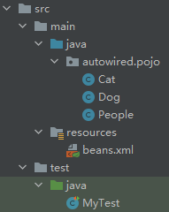
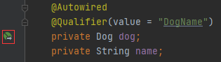

## 7.1-自动装配的描述

自动装配是Spring满足bean依赖的一种方式

Spring会在上下文中自动寻找，并自动给bean装配属性

## 7.2-Spring三种装配的方式

1. 在xml中显示配置
2. 在java中显示装配
3. 隐式的自动装配bean

## 7.3-测试

### 7.3.1-文件结构


### 7.3.2-文件代码

1. Cat.java

   ```java
   package autowired.pojo;
   
   public class Cat {
       public void shout(){
           System.out.println("喵喵");
       }
   }
   ```

2. Dog.java

   ```java
   package autowired.pojo;
   
   public class Dog {
       public void shout(){
           System.out.println("汪汪");
       }
   }
   ```

3. People.java

   ```java
   package autowired.pojo;
   
   public class People {
       private Cat cat;
       private Dog dog;
       private String name;
   
       //生成get() && set()
       //生成toString()
   }
   ```

4. beans.xml

   ```xml
   <bean id="cat" class="autowired.pojo.Cat"></bean>
   <bean id="dog" class="autowired.pojo.Dog"></bean>
   <bean id="people" class="autowired.pojo.People">
       <property name="cat" ref="cat"></property>
       <property name="dog" ref="dog"></property>
       <property name="name" value="名字"></property>
   </bean>
   ```

5. MyTest.java

   ```java
   import autowired.pojo.People;
   import org.junit.Test;
   import org.springframework.context.ApplicationContext;
   import org.springframework.context.support.ClassPathXmlApplicationContext;
   
   public class MyTest {
       @Test
       public void test1(){
           ApplicationContext context = new ClassPathXmlApplicationContext("beans.xml");
           People people = context.getBean("people", People.class);
           people.getCat().shout();
           people.getDog().shout();
       }
   }
   ```

## 7.4-Bean自动装配

| Mode          | Explanation                                                  |
| ------------- | ------------------------------------------------------------ |
| `no`          | (默认)无自动装配。 Bean 引用必须由`ref`元素定义。对于大型部署，建议不要更改默认设置，因为明确指定协作者可以提供更好的控制和清晰度。在某种程度上，它记录了系统的结构。 |
| `byName`      | 按属性名称自动布线。 Spring 寻找与需要自动装配的属性同名的 bean。例如，如果一个 bean 定义被设置为按名称自动装配，并且包含一个`master`属性(即，它具有`setMaster(..)`方法)，那么 Spring 将查找一个名为`master`的 bean 定义并使用它来设置属性。 |
| `byType`      | 如果容器中恰好存在一个该属性类型的 bean，则使该属性自动装配。如果存在多个错误，则会引发致命异常，这表明您可能不对该 bean 使用`byType`自动装配。如果没有匹配的 bean，则什么也不会发生(未设置该属性)。 |
| `constructor` | 类似于`byType`，但适用于构造函数参数。如果容器中不存在构造函数参数类型的一个 bean，则将引发致命错误。 |

- byName，需要保证所有的bean的id唯一，并且这个bean需要和自动注入的属性的set方法的值一致，且第一个字母小写
- byType，需要保证所有bean的class唯一，并且，这个bean需要和自动注入的属性的类型一致

### 7.4.1-`byName`

byName: 会自动在容器上下文中查找，和自己对象`set`方法后面的值对应的`beanid`

将`beans.xml`文件中的内容更改为：

```xml
<bean id="cat" class="autowired.pojo.Cat"></bean>
<bean id="dog" class="autowired.pojo.Dog"></bean>
<!--
byName: 会自动在容器上下文中查找，和自己对象set方法后面的值对应的beanid
-->
<bean id="people" class="autowired.pojo.People" autowire="byName">
    <property name="name" value="名字"></property>
</bean>
```

此时，`test1()`输出为：

```cmd
喵喵
汪汪
```

将`id="dog"`改成`id="dogName"`，进入`People.java`文件，可见，`setDog()`方法变灰，没有被使用

`test1()`此时的输出为：空指针

```cmd
喵喵

java.lang.NullPointerException
	at MyTest.test1(MyTest.java:12)
	......
```

然后，我们将`setDog()`方法改名为`setDogName()`，可见`setDogName()`方法显示被使用了，此时的输出结果为：

```cmd
喵喵
汪汪
```

可见，`byName`: 会自动在容器上下文中查找，和自己对象`set`方法后面的值对应的`beanid`

==值得注意的是：==`bean`中的`id`应为小写开头，否则，spring也不能识别。

> `beans.xml`文件部分内容
>
> ```xml
> <bean id="DogName" class="autowired.pojo.Dog"></bean>
> ```
>
> `People.java`文件部分内容
>
> ```java
> public void setDogName(Dog dog) {
>     this.dog = dog;
> }
> ```
>
> `test1()`的输出结果为：空指针
>
> ```cmd
> 喵喵
> 
> java.lang.NullPointerException
> 	at MyTest.test1(MyTest.java:12)
> 	......java
> ```
>

### 7.4.2-`byType`

byType: 会自动在容器上下文中查找，和自己对象属性类型相同的bean

`beans.xml`文件内容：

```xml
<bean id="cat" class="autowired.pojo.Cat"></bean>
<bean id="Dog" class="autowired.pojo.Dog"></bean>
<!--
byType: 会自动在容器上下文中查找，和自己对象属性类型相同的bean
-->
<bean id="people" class="autowired.pojo.People" autowire="byType">
    <property name="name" value="名字"></property>
</bean>
```

`People.java`部分内容：

```java
public void setDog(Dog dog) {
    this.dog = dog;
}
```

根据`byName`方法，`bean`中`id`的首字母应该为小写，上述例子应该输出有误，显示引用空指针

但将自动装配的方法设置为`byType`，系统会自动寻找和自己属性类型相同的`bean`进行自动装配

输出结果为：

```cmd
喵喵
汪汪
```

==值得注意的是：==`beans.xml`中的采用`byType`方式自动装配的对象，应该唯一，否则会报错。

> ```xml
> <bean id="cat" class="autowired.pojo.Cat"></bean>
> <bean id="Dog" class="autowired.pojo.Dog"></bean>
> <bean id="Dog1" class="autowired.pojo.Dog"></bean>
> <!--
> byType: 会自动在容器上下文中查找，和自己对象属性类型相同的bean
> -->
> <bean id="people" class="autowired.pojo.People" autowire="byType">
>     <property name="name" value="名字"></property>
> </bean>
> ```
>
> 此时，系统会报错，显示：`There is more than one bean of 'Dog' type.Beans:Dog,Dog1`
>

==注：==`beans.xml`中的采用`byType`方式自动装配的对象，哪怕`id`为空/不填写，也可以正常装配，即`byType`方式，不以`id`为依据，不受其影响

> ```xml
> <bean id="cat" class="autowired.pojo.Cat"></bean>
> <bean class="autowired.pojo.Dog"></bean>
> <!--
> byType: 会自动在容器上下文中查找，和自己对象属性类型相同的bean
> -->
> <bean id="people" class="autowired.pojo.People" autowire="byType">
>     <property name="name" value="名字"></property>
> </bean>
> ```
>
> 其输出如下：
>
> ```cmd
> 喵喵
> 汪汪
> ```
>

## 7.4-基于注解的自动装配

jdk1.5开始支持的注解，Spring从2.5开始支持

由于定义方式的不同，注解 在声明中提供了很多上下文，从而使配置更短，更简洁。但是，XML 擅长连接组件而不接触其源代码或重新编译它们。一些开发人员更喜欢将布线放置在靠近源的位置，而另一些开发人员则认为带注解的类不再是 POJO，而且，该配置变得分散且难以控制。

### 7.4.1-设置所需标记和配置

使用基于注解的自动装配，需要包含以下标记来隐式注册

在`beans`标签中导入`xmlns:context="http://www.springframework.org/schema/context"`

在`beans`标签内部，设置`<context:annotation-config/>`

在`xsi:schemaLocation`后增加`http://www.springframework.org/schema/context http://www.springframework.org/schema/context/spring-context.xsd"`

```xml
<?xml version="1.0" encoding="UTF-8"?>
<beans xmlns="http://www.springframework.org/schema/beans"
       xmlns:xsi="http://www.w3.org/2001/XMLSchema-instance"
       xmlns:context="http://www.springframework.org/schema/context"
       xsi:schemaLocation="http://www.springframework.org/schema/beans http://www.springframework.org/schema/beans/spring-beans.xsd
       http://www.springframework.org/schema/context http://www.springframework.org/schema/context/spring-context.xsd">

    <context:annotation-config/>
</beans>
```

小技巧

1. 将自动创建出来的`beans`标签中的第一行`xmlns="http://www.springframework.org/schema/beans"`中的`beans`改成`context`，在`xmlns`后加上`:context`
2. 将`xsi:schemaLocation`后的内容重复一遍(不带引号)，并强`beans`全部改成`context`
3. 或者是，直接输入`<context:annotation-config/>`后，按下`ALT+INSERT`，选择第一个，自动填充配置

### 7.4.2-代码范例



1. Cat.java

   ```java
   package autowired.pojo;
   
   public class Cat {
       public void shout(){
           System.out.println("喵喵");
       }
   }
   ```

2. Dog.java

   ```java
   package autowired.pojo;
   
   public class Dog {
       public void shout(){
           System.out.println("汪汪");
       }
   }
   ```

3. People.java

   ```java
   package autowired.pojo;
   
   import org.springframework.beans.factory.annotation.Autowired;
   
   public class People {
       @Autowired
       private Cat cat;
       @Autowired
       private Dog dog;
       private String name;
   
       public Cat getCat() {
           return cat;
       }
   
       public void setCat(Cat cat) {
           this.cat = cat;
       }
   
       public Dog getDog() {
           return dog;
       }
   
       public void setDog(Dog dog) {
           this.dog = dog;
       }
   
       public String getName() {
           return name;
       }
   
       public void setName(String name) {
           this.name = name;
       }
   }
   ```

4. beans.xml

   ```xml
   <?xml version="1.0" encoding="UTF-8"?>
   <beans xmlns="http://www.springframework.org/schema/beans"
          xmlns:xsi="http://www.w3.org/2001/XMLSchema-instance"
          xmlns:context="http://www.springframework.org/schema/context"
          xsi:schemaLocation="http://www.springframework.org/schema/beans http://www.springframework.org/schema/beans/spring-beans.xsd http://www.springframework.org/schema/context https://www.springframework.org/schema/context/spring-context.xsd">
   
       <context:annotation-config></context:annotation-config>
   
       <bean id="cat" class="autowired.pojo.Cat"></bean>
       <bean id="dog" class="autowired.pojo.Dog"></bean>
   
       <bean id="people" class="autowired.pojo.People"></bean>
   
   
   </beans>
   ```

5. MyTest.java

   ```java
   import autowired.pojo.People;
   import org.junit.Test;
   import org.springframework.context.ApplicationContext;
   import org.springframework.context.support.ClassPathXmlApplicationContext;
   
   public class MyTest {
       @Test
       public void test1(){
           ApplicationContext context = new ClassPathXmlApplicationContext("beans.xml");
           People people = context.getBean("people", People.class);
           people.getCat().shout();
           people.getDog().shout();
       }
   }
   ```

#### `@Autowired`

在`beans.xml`中`注册三个实例`并`配置基于注解装配的标记`，没有进行任何其他的注入等操作

此时，可在`Cat.java`、`Dog.java`、`People.java`中发现，这三个类都被自动配置完成了。但`People.java`这个类中的`Cat`和`Dog`并没有被装入


然后，在`People.java`的`Cat`和`Dog`变量上（也可以加在对应的`set()`方法上），都加上注解`@Autowired`

此时，可发现，`Cat`和`Dog`都被自动装配了，并且装配的内容就是`beans.xml`中设置的`cat`和`dog`


==值得注意的是：==`@Autowire`优先按类型`byType`，找不到就报错，找到多个则按名字`byName`，若还是找不到，就报错

> 将`beans.xml`文件修改为
>
> ```xml
> <context:annotation-config></context:annotation-config>
> 
> <bean id="cat" class="autowired.pojo.Cat"></bean>
> <bean id="DogName" class="autowired.pojo.Dog"></bean>
> 
> <bean id="people" class="autowired.pojo.People"></bean>
> ```
>
> 此时点击`People.java`文件中Dog处的叶子(企业版下有)
>
> 
>
> 光标会弹至`beans.xml`中`id="DogName"`处的`bean`标签上，表明，该自动装配装配的是`id="DogName"`的实例
>
> 将`beans.xml`文件修改为
>
> ```xml
> <context:annotation-config></context:annotation-config>
> 
> <bean id="cat" class="autowired.pojo.Cat"></bean>
> <bean id="DogName" class="autowired.pojo.Dog"></bean>
> <bean id="dog" class="autowired.pojo.Dog"></bean>
> 
> <bean id="people" class="autowired.pojo.People"></bean>
> ```
>
> 此时点击`People.java`文件中Dog处的叶子
>
> 光标会弹至`beans.xml`中`id="dog"`处的`bean`标签上，表明，该自动装配装配的是`id="dog"`的实例

此外，一旦使用`@Autowired`，可以不实现对应的`set()`方法（因为这种方法是通过==构造器注入==），但不推荐，官方推荐`@Autowired`写在对应的`set()`方法上

##### `@Nullable`

字段标记了这个注解，说明这个字段可以为null

> 为`People`类添加含参构造函数
>
> ```java
> public People(String name) {
>     this.name = name;
> }
> ```
>
> 然后，添加注解`@Nullable`
>
> ```java
> public People(@Nullable String name) {
>     this.name = name;
> }
> ```
>
> 添加完这个注解后，即使在创建实例时没有设置`name`，即`name`为空，程序也不会报错

进入`@Autowired`源代码，可见`Autowired`中有一个参数`required`，其值默认为true

```java
public @interface Autowired {
    boolean required() default true;
}
```

`required`（`boolean`类型）的意义为：被标注`@Autowired`的字段，是否一定需要

true ——> 一定需要，即不能为null

false ——> 不一定需要，即能为null

##### `@Qualifier`

在`beans.xml`中定义了多个实例时，可使用`@Autowired`+`@Qualifier(value = "")`来指定具体装配哪个实例

`@Qualifier`中的`value`，应填充的值为实例的`id`

> 将`People.java`文件中的`Dog`部分修改为：
>
> ```java
> @Autowired
> @Qualifier(value = "DogName")
> private Dog dog;
> ```
>
> 此时，`beans.xml`中的实例为：
>
> ```xml
> <bean id="DogName" class="autowired.pojo.Dog"></bean>
> <bean id="dog" class="autowired.pojo.Dog"></bean>
> ```
>
> 此时，点击
>
> 
>
> 光标会弹至`beans.xml`中`id="DogName"`处的`bean`标签上，表明，该自动装配装配的是`id="DogName"`的实例
>
> 从而实现，指定装配

#### `@Resource`

有多个重要属性，其中有两个很重要

- name
- type

如果使用`name`属性，则使用`byName`的自动注入策略，而使用`type`属性时则使用`byType`自动注入策略。

如果既不制定`name`也不制定`type`属性，这时将通过反射机制使用`byName`自动注入策略，即默认使用`byName`属性

==总结：==`@Resource`默认使用`byName`的自动装配策略，如果找不到对应的`id`，则采用`byType`的方式，如果找不到对应的类型或者对应的类型有两个及以上，则会报错

> `People.java`中的代码为
>
> ```java
> @Resource
> private Dog dog;
> ```
>
> `beans.xml`中的代码为
>
> ```xml
> <bean id="DogName" class="autowired.pojo.Dog"></bean>
> <bean id="dog1" class="autowired.pojo.Dog"></bean>
> ```
>
> `beans.xml`中有对应`type`的两个实例，但`id`不能对应`set`方法后的名称
>
> `Dog`默认通过`byName`查找，但找不到，于是通过`byType`，但对应类型的实例有两个，于是会报错
>
> 此时，运行`test1()`，提示：
>
> No qualifying bean of type 'autowired.pojo.Dog' available: expected single matching bean but found 2: DogName,dog1

